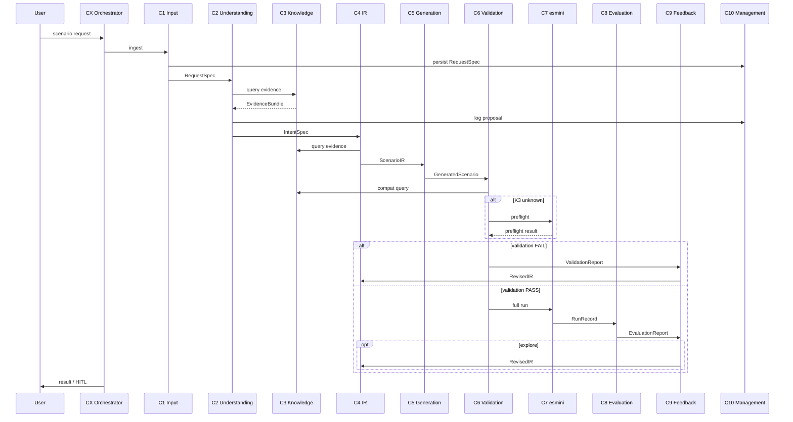

# Component Connection Map — ScenarioChef Phase 1

**Project:** ScenarioChef  
**Purpose:** Document data flow, control flow, and dependency edges between C1–C10 and CX for a single user request.  
**Companion:** [`component_inventory.md`](component_inventory.md)  
**Architecture status:** Frozen (`docs/checkpoint.md`)

---

## 1. End-to-end pipeline (happy path)

```
┌──────────┐
│   User   │
└────┬─────┘
     │ raw input (NL, files, params)
     ▼
┌──────────────────────────────────────────────────────────────────────────┐
│  CX  Orchestrator (L0) — DAG, HITL, loop budget, provenance fan-out   │
└──────────────────────────────────────────────────────────────────────────┘
     │
     ▼
┌─────────┐   RequestSpec    ┌─────────┐   IntentSpec     ┌─────────┐
│   C1    │ ───────────────► │   C2    │ ───────────────► │   C4    │
│  Input  │                  │Understand│◄── Evidence ────│   IR    │
└─────────┘                  └────┬────┘      Bundle       └────┬────┘
                                  │              ▲               │
                                  │         ┌────┴────┐          │
                                  └────────►│   C3    │◄─────────┘
                                            │Knowledge│ (queries during C2, C4, C5, C6)
                                            └─────────┘
                                                   │
     ScenarioIR                                    │
         │                                         │
         ▼                                         │
┌─────────┐  GeneratedScenario   ┌─────────┐      │
│   C5    │ ───────────────────► │   C6    │──────┘ (compat hints, bounds)
│  Gen    │                      │ Validate│
└─────────┘                      └────┬────┘
                                      │ PASS
                                      ▼
                               ┌─────────┐  RunRecord   ┌─────────┐
                               │   C7    │ ───────────► │   C8    │
                               │ esmini  │              │  Eval   │
                               └─────────┘              └────┬────┘
                                                             │
                                      ┌──────────────────────┘
                                      ▼
                               ┌─────────┐  RevisedIR
                               │   C9    │ ───────────────► back to C4
                               │Feedback │      (repair or explore)
                               └─────────┘

         All components ──────────────────────────────────────► C10 (persist)
```

---

## 2. Connection matrix

Rows = **from** component. Columns = **to** component.  
Legend: **D** = data artifact, **Q** = query, **C** = control/command, **P** = persist.

| From ↓ / To → | C1 | C2 | C3 | C4 | C5 | C6 | C7 | C8 | C9 | C10 | CX | User |
| --- | --- | --- | --- | --- | --- | --- | --- | --- | --- | --- | --- | --- |
| **User** | D | | | | | | | | | | C | |
| **CX** | C | C | C | C | C | C | C | C | C | C | | C (HITL) |
| **C1** | | D | | | | | | | | P | | C (HITL) |
| **C2** | | | Q | D | | | | | | P | | C (HITL) |
| **C3** | | D | | D | D | D | | | | | | |
| **C4** | | | Q | | D | | | D | D | P | | |
| **C5** | | | | | | D | | | | P | | |
| **C6** | | | Q | | | | C† | | D | P | D | |
| **C7** | | | | | | | | D | | P | | |
| **C8** | | | | | | | | | D | P | D | |
| **C9** | | | Q‡ | D | | | | | | P | D | C (E08 escalate) |
| **C10** | | | Q‡ | | | | | | | | | |

† C6 S6 invokes C7 `preflight` only when K3=unknown.  
‡ C9 reads E10 history from C10, not from C3.

---

## 3. Data artifacts on each edge

| Edge | Artifact | Direction | Notes |
| --- | --- | --- | --- |
| User → C1 | Raw input | in | All Phase-1 modalities |
| C1 → C2 | `RequestSpec` | forward | Normalized, schema-valid |
| C2 → C3 | Feature/catalog/map queries | bidirectional | C3 returns `EvidenceBundle` |
| C2 → C4 | `IntentSpec` | forward | After schema validation |
| C3 → C2, C4, C5, C6 | `EvidenceBundle` | pull | Definitions, K3 compatibility, assumptions |
| C4 → C5 | `ScenarioIR` | forward | Canonical semantic model |
| C5 → C6 | `GeneratedScenario` | forward | `.xosc` / `.xodr` + K3 flags |
| C6 → C7 | `RunConfig` + scenario files | forward | S6: `preflight` only |
| C7 → C8 | `RunRecord` | forward | CSV / optional OSI |
| C8 → C9 | `EvaluationReport` | forward | Metrics + objective pass/fail |
| C6 → C9 | `ValidationReport` | forward | On FAIL — repair path |
| C9 → C4 | `RevisedIR` | loop | Re-enter compile pipeline |
| * → C10 | All records | persist | Full provenance chain |
| CX → User | HITL prompts | out | Missing params, acks, E08 escalate |

---

## 4. Control flows

### 4.1 Main DAG (CX-enforced order)

CX **must** invoke in this order for each generation attempt:

```
C1 → C2 → C4 → C5 → C6 → C7 → C8
```

C3 is queried opportunistically during C2, C4, C5, and C6. C10 receives writes after each step.

**Non-skippable:** C4, C6, C7 (CX-Q5).

### 4.2 Validation failure loop

```
C5 → C6 ──FAIL──► C9 (repair) ──► C4 → C5 → C6 …
         │
         └── E08 user-explicit slot ──► CX HITL (no C9 lane rewrite)
```

Max iterations: **5** or no metric gain; wall-clock **5 min** per request.

### 4.3 Exploration loop (post-success)

```
C6 PASS → C7 → C8 ──► C9 (explore) ──► C4 → … → C8
```

Parameter search operates on IR ranges; distinct from C5 compile-time expansion.

### 4.4 HITL gates (CX)

| Trigger | Source | Action |
| --- | --- | --- |
| Missing parameter | C1, C2 | Ask user |
| Contradiction | C1 | Ask user |
| Low confidence / `unknowns[]` | C2 | Ask user |
| C3 assumption defaults | C1 + C2 | Both must ack before C4 |
| Map topology with user-explicit lane | C6 → C9 | Escalate; no silent repair |

---

## 5. Knowledge vs execution authority

Three notions of correctness flow through different components:

```
                    ┌─────────────────┐
                    │  OSC XSD valid?  │  C3 definitions + C6 S1/S2
                    └────────┬────────┘
                             ▼
                    ┌─────────────────┐
                    │  Map / semantic  │  C6 S3/S4 (topology in C6, not C3)
                    │     valid?       │
                    └────────┬────────┘
                             ▼
                    ┌─────────────────┐
                    │ esmini executes? │  C3 K3 matrix + C6 S6 (if unknown) + C7
                    └────────┬────────┘
                             ▼
                    ┌─────────────────┐
                    │ Behavior matches │  C8 rulebook vs IR objectives
                    │    intent?       │
                    └─────────────────┘
```

| Question | Authoritative component |
| --- | --- |
| What is this OSC construct? | C3 (OSC XSD wins) |
| Will pinned esmini build run it? | C3 K3; if `unknown` → C6 S6 / C7 preflight |
| Does lane N exist on map? | C6 S3 (not C3) |
| Did scenario meet objective? | C8 vs IR stubs |
| What failed before and how? | C10 (E10 history for C9) |

---

## 6. Cross-cutting concerns

### 6.1 Provenance (via C10)

Every request maintains lineage:

```
RequestSpec → IntentSpec → ScenarioIR → GeneratedScenario
  → ValidationReport → RunRecord → EvaluationReport → FeedbackAction(s)
```

Linked by C10 record IDs and content hashes.

### 6.2 Loop budgets (CX + C9)

| Budget | Value | Applies to |
| --- | --- | --- |
| Repair/explore iterations | N ≤ 5 | C9 loops |
| Metric stall | stop if no gain | C9 explore |
| Wall-clock | 5 min / request | CX |

### 6.3 Phase-1 simulator boundary

```
C5 (.xosc) → C6 → C7 (esmini) → C8
```

No edges to CARLA, ScenarioRunner, or OSC2Runner in Phase 1.

---

## 7. Component dependency graph (build order)

Recommended implementation order based on contract dependencies:

```
Layer 0 (foundation):
  C10 (persistence schemas)
  C3  (knowledge graph — SEQ-1 first detailed implementation)

Layer 1 (intent):
  C1 → C2

Layer 2 (semantic core):
  C4 → C5

Layer 3 (quality gate):
  C6 ↔ C7 (preflight integration)

Layer 4 (closure):
  C8 → C9

Layer 5 (integration):
  CX (wires all APIs)
```

---

## 8. Mermaid — request sequence diagram



---

## 9. Related documents

| Document | Role |
| --- | --- |
| [`docs/checkpoint.md`](docs/checkpoint.md) | Frozen decision log |
| [`docs/trajectories.md`](docs/trajectories.md) | Capability refinement + E01–E10 |
| [`docs/tldraw_architecture.md`](docs/tldraw_architecture.md) | Visual abstraction layers |
| [`docs/adr/`](docs/adr/) | Per-component architecture decisions |
