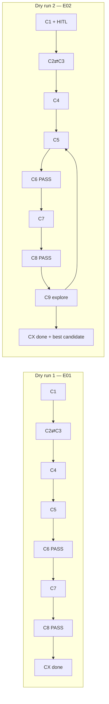

# Phase 1 — Initial Architecture Dry Runs

Conceptual walkthroughs of the frozen C1–C10 + CX pipeline (`checkpoint.md`).  
These are **not** executed esmini runs — they trace artifacts, decisions, and branches through each component.

| Dry run | Experiment | Path | Primary purpose |
| --- | --- | --- | --- |
| 1 | E01 — Constant-Speed Following | Happy path, single pass | Baseline pipeline: input → IR → compile → validate → sim → evaluate |
| 2 | E02 — Sudden Lead Braking | Happy path + C9 explore loop | Triggers, HITL, TTC/PET, post-PASS parameter search |

**Architecture references:** `checkpoint.md`, tldraw board `Automated Scenario Architecture`, `trajectories.md`.

---

## Shared architecture context

### Control flow (CX)

CX is a **hardcoded DAG** (not an LLM). It calls C1→C2⇄C3→C4→C5→C6; on PASS → C7→C8→C9; on C6 FAIL → C9→C5→C6. It **cannot** skip or reorder C4, C6, or C7.

- **Only LLM agent:** C2 (proposes slots; deterministic schema validates).
- **Loop budget:** C9 stops at **N=5 iterations OR no metric gain**, plus **5-minute wall-clock** per request (CX-Q4).
- **HITL:** C1/C2 ask the user on missing params, contradictions, low confidence, and C3 assumption acks.

### C6 validation funnel (Phase 1)

| Stage | Always? | Notes |
| --- | --- | --- |
| S1 XML/XSD | Yes | |
| S2 Semantic/refs | Yes | |
| S3 Map topology | Yes | E08 lives here |
| S4 Physical plausibility | Yes | Catalog + C1/C2-acked assumptions |
| S5 Reachability | **No** | Skipped in Phase 1 |
| S6 Preflight dry-run | **Only if K3=unknown** | C7 runner `mode=preflight` |

### Persistence (C10)

Every envelope is stored: RequestSpec → IntentSpec → ScenarioIR → ScenarioBundle → ValidationReport → RunRecord → EvaluationReport → FeedbackRecord. C2/C9 proposals are logged as action records.

---

## Dry run 1 — E01 Constant-Speed Following

### Objective

Test basic longitudinal interaction: ego follows lead at constant speed on a straight two-lane road.  
**Tests:** Scenario Understanding + IR + basic generation + simulation + observation.  
**Expected result:** PASS (single CX pass, no C9 loop).

### User request

> “Create a following scenario: ego and lead both at 15 m/s, 30 m gap, same lane, straight two-lane road, run 20 s.”

`request_id = req-001`

---

### Step 0 — CX orchestration

CX starts the DAG. E01 is expected to complete in **one pass** with no C9 involvement.

---

### Step 1 — C1 Scenario Input

**Role:** Deterministic normalization + validation. Not an agent. Does not interpret meaning.

**Output — RequestSpec:**

```yaml
request_id: req-001
intent_text: "following scenario, ego and lead 15 m/s, 30 m gap, same lane, 20 s"
parameters:
  ego_speed:  { value: 15, unit: m/s, source: user-explicit }
  lead_speed: { value: 15, unit: m/s, source: user-explicit }
  gap:        { value: 30, unit: m,  source: user-explicit }
  duration:   { value: 20, unit: s,  source: user-explicit }
missing: []
contradictions: []
assumption_acks: []
```

**C10:** raw input + RequestSpec.

**HITL:** Not triggered — all parameters explicit.

---

### Step 2 — C2 Scenario Understanding (+ C3)

**Role:** LLM proposes IntentSpec slots; schema validates. Never rewrites user-explicit values.

**C3 queries (examples):**

| Query | Purpose |
| --- | --- |
| Q-DEF: `SpeedAction` | OSC definition |
| Q-COMPAT: lane position, relative distance | K3 matrix for pinned esmini build |

**C3 result:** Features are `supported` (not `unknown`) → C6 S6 preflight will be skipped.

**Output — IntentSpec:**

```yaml
actors: [ego, lead]
relations: [following, same_lane]
initial_state:
  ego.speed: 15 m/s
  lead.speed: 15 m/s
  gap: 30 m
maneuvers: [lead_maintain_speed, ego_follow]
triggers: [start_immediately]
objective_stub: stable_following
unknowns: []
confidence: high
```

**C10:** IntentSpec + C2 action record.

---

### Step 3 — C4 Scenario IR / World Model

**Role:** Scenic-like IR language (not CARLA). Frame-tagged positions. Ranges allowed; no distributions.

**Output — ScenarioIR:**

```yaml
ScenarioIR:
  map: { id: map_straight_2lane_v1, hash: abc123 }
  actors:
    ego:  { role: ego,  init: { lane: 1, s_offset: 0,   speed: 15 m/s } }
    lead: { role: lead, init: { lane: 1, s_offset: -30, speed: 15 m/s } }
  behaviors:
    lead: maintain_speed(15 m/s)
    ego:  follow(lead, target_gap: 30 m)
  triggers: [on_start]
  duration: 20 s
  evaluation_stubs: [stable_gap, no_collision]
  suggestions: []
```

**C10:** ScenarioIR v1.

---

### Step 4 — C5 Scenario Generation

**Role:** Compiler-only (scenariogeneration). Consumes IR; does not mutate it. Diffusion/CTG out of Phase 1.

**Output — ScenarioBundle:**

```yaml
files:
  scenario.xosc
  map_ref: map_straight_2lane_v1.xodr
feature_keys_emitted:
  - SpeedAction
  - RelativeDistance
  - LanePosition
manifest:
  ir_version: v1
  bundle_hash: <hash>
  seed: null
```

No range expansion needed (all point values).

**C10:** bundle + hash.

---

### Step 5 — C6 Validation & QA

| Stage | E01 result |
| --- | --- |
| S1 XML/XSD | PASS |
| S2 Semantic/refs | PASS |
| S3 Map topology | PASS (both on lane 1) |
| S4 Physical plausibility | PASS |
| S5 Reachability | skipped |
| S6 Preflight | skipped (no K3=unknown) |

```yaml
ValidationReport:
  status: PASS
  phase: S4_complete
  diagnostics: []
```

**Branch not taken:** FAIL → C9 → C5 → C6.

**C10:** ValidationReport.

---

### Step 6 — C7 esmini Simulation

**Role:** One runner, `mode=full`. Default controller only. Not an agent.

**RunConfig:**

```yaml
esmini_build: esmini-2.48.0   # example pinned build
dt: 0.05
seed: 42
max_time: 20 s
headless: true
osi: false                    # optional per freeze
```

**Output — RunRecord:**

```yaml
run_id: run-001
termination: time_limit
states: [...]                 # ego/lead positions over 20 s
logs: [...]
runtime_errors: []
```

**Expected behaviour:** Both vehicles in same lane; gap ~30 m stable; no collision; no teleportation.

**C10:** RunRecord + config pins.

---

### Step 7 — C8 Observation & Evaluation

**Role:** Deterministic metrics + rulebook pass/fail against IR objective stubs. No LLM layer-4. TTC always paired with PET.

**Output — EvaluationReport:**

```yaml
metrics:
  min_gap: ~28–32 m
  ttc: large                  # no threat
  pet: n/a
  collision: false
objective_status: PASS        # stable_gap + no_collision stubs
completion: true
```

**C10:** EvaluationReport.

---

### Step 8 — C9 Feedback

**Not invoked.** E01 PASS with no exploration request → CX terminates.

---

### Step 9 — CX termination

**Deliverable:** Nominal E01 scenario PASS. Full lineage in C10.

```
req-001 → IntentSpec → IR v1 → bundle → ValidationReport PASS
       → run-001 → EvaluationReport PASS
```

---

### E01 — What was proven vs not exercised

| Proven | Not exercised |
| --- | --- |
| Full happy-path pipeline | Multimodal / crash-text C1 adapters |
| C2 LLM + schema gate | Low-confidence HITL |
| C3 evidence queries | K3=unknown → C6 S6 dry-run |
| Scenic-like IR → compiler | IR range expansion (C5) |
| C6 S1–S4 | S5 reachability, E09 |
| C7 run + RunConfig pins | GUI debug mode |
| C8 rulebook + metrics | OSI stream (CSV path) |
| C10 lineage | C9 repair/explore loop |

---

## Dry run 2 — E02 Sudden Lead Braking

### Objective

Test longitudinal interaction and **triggered braking**.  
**Tests:** Trigger generation + longitudinal action + evaluation.  
**Expected result:** PASS on nominal run; **C9 explore loop** may run afterward.

### User request

> “Ego and lead both at 20 m/s, 40 m gap. After 5 seconds the lead brakes hard for 3 seconds. Straight road. Check ego response.”

`request_id = req-002`

---

### What is new vs E01

| Capability | E01 | E02 |
| --- | --- | --- |
| Triggers | `on_start` only | `simulation_time > 5 s` |
| Maneuvers | maintain / follow | cruise → decelerate |
| C3 queries | speed, lane | + time condition, AbsoluteSpeedAction |
| C8 focus | gap stability | **TTC + PET**, headway collapse |
| C9 | no loop | **explore** after PASS |

---

### Step 0 — CX orchestration

CX starts `req-002`. Budget: 5 min wall, N=5 or no gain. Expect **multiple passes** if C9 explores.

---

### Step 1 — C1 Scenario Input

**Output — RequestSpec (initial):**

```yaml
request_id: req-002
parameters:
  ego_speed:      { value: 20, unit: m/s, source: user-explicit }
  lead_speed:     { value: 20, unit: m/s, source: user-explicit }
  gap:            { value: 40, unit: m,  source: user-explicit }
  trigger_time:   { value: 5,  unit: s,  source: user-explicit }
  brake_duration: { value: 3,  unit: s,  source: user-explicit }
missing:
  - lead_deceleration_rate     # "hard" is not numeric
contradictions: []
```

**HITL (C1-Q2):** CX asks user for deceleration rate.  
**User answer:** `−5 m/s²` → added as user-explicit parameter (not a C3 assumption).

**C10:** RequestSpec + HITL exchange.

---

### Step 2 — C2 Scenario Understanding (+ C3)

**C3 queries:**

| Query | Result |
| --- | --- |
| Q-DEF: `SimulationTimeCondition` | OSC definition |
| Q-DEF: `AbsoluteSpeedAction` / decel profile | definition + catalog example |
| Q-COMPAT: time trigger + speed action chain | `supported` |

**Output — IntentSpec:**

```yaml
actors: [ego, lead]
relations: [following, same_lane]
initial_state:
  ego.speed: 20 m/s
  lead.speed: 20 m/s
  gap: 40 m
phases:
  - name: cruise
    until: simulation_time > 5 s
  - name: lead_brake
    trigger: simulation_time > 5 s
    lead.action: decelerate at -5 m/s² for 3 s
maneuvers: [cruise, lead_brake]
objective_stub: ego_survives_braking_event
unknowns: []
```

**C10:** IntentSpec + C2 action record.

---

### Step 3 — C4 Scenario IR

**Output — ScenarioIR:**

```yaml
ScenarioIR:
  map: { id: map_straight_2lane_v1, hash: abc123 }
  actors:
    ego:  { init: { lane: 1, s: 0,  speed: 20 m/s } }
    lead: { init: { lane: 1, s: -40, speed: 20 m/s } }
  storyboard:
    - phase: cruise
      duration: until t > 5 s
      lead: maintain_speed(20 m/s)
      ego:  follow(lead, gap: 40 m)
    - phase: lead_brake
      trigger: simulation_time > 5 s
      lead: absolute_speed_profile(decel: -5 m/s², duration: 3 s)
      ego:  follow(lead)              # observe; no scripted ego brake
  evaluation_stubs:
    - min_ttc_during_event
    - no_collision
    - lead_speed_decreases_after_t5
  suggestions: []
```

**C10:** ScenarioIR v1.

---

### Step 4 — C5 Scenario Generation

**Emitted OpenSCENARIO structure (conceptual):**

- Init: both at 20 m/s, 40 m gap
- Event 1: StartTrigger — cruise
- Event 2: `SimulationTimeCondition > 5` → `AbsoluteSpeedAction` on lead (−5 m/s², 3 s)
- Ego: Default controller (lane follow)

```yaml
ScenarioBundle:
  feature_keys_emitted:
    - SimulationTimeCondition
    - AbsoluteSpeedAction
    - LanePosition
  bundle_hash: def456
```

**C10:** bundle.

---

### Step 5 — C6 Validation

| Stage | E02 result |
| --- | --- |
| S1–S4 | PASS |
| S5 | skipped |
| S6 | skipped (features K3=supported) |

```yaml
ValidationReport: { status: PASS, phase: S4_complete }
```

**C7 allowed.**

---

### Step 6 — C7 esmini Simulation

**RunConfig:**

```yaml
esmini_build: esmini-2.48.0
dt: 0.05
seed: 42
max_time: 25 s
headless: true
```

**Expected trace:**

| Time | Event |
| --- | --- |
| 0–5 s | Both ~20 m/s, gap ~40 m |
| t = 5 s | Trigger fires; lead decelerates |
| 5–8 s | Gap shrinks; TTC drops |
| 8+ s | Lead at lower speed |

```yaml
RunRecord:
  run_id: run-002
  termination: time_limit
  trigger_log:
    - { name: lead_brake, fired_at: 5.0 s, ok: true }
  runtime_errors: []
```

**C10:** RunRecord.

---

### Step 7 — C8 Observation & Evaluation

```yaml
EvaluationReport:
  metrics:
    lead_speed_at_t5: 20 m/s
    lead_speed_at_t8: ~5 m/s
    min_gap: ~15–25 m
    min_ttc: 2.8 s
    min_pet: 1.1 s              # paired with TTC (C8-Q4)
    collision: false
    trigger_fired: { lead_brake: true }
  objective_status: PASS
  completion: true
```

**Example rulebook checks (C4 stub → C8 thresholds):**

- `lead_speed_decreases_after_t5` → PASS
- `no_collision` → PASS
- `min_ttc_during_event` → PASS (e.g. threshold > 1.0 s)

**C10:** EvaluationReport.

---

### Step 8 — C9 Feedback (explore loop)

**Path:** `explore` (C6 PASS; no structural repair).

**C9 search** mutates IR **parameters only** (C9-Q2: rules on structure, search on params). Never changes user-explicit slots (C9-Q6).

| Iteration | Mutation | Notes |
| --- | --- | --- |
| 1 (baseline) | — | gap=40, decel=−5, t_trigger=5 |
| 2 | gap 40 → 25 m | smaller headway |
| 3 | decel −5 → −7 m/s² | harder brake |
| 4 | trigger 5 → 3 s | earlier brake |
| 5 | gap 25 + decel −7 | combined stress |

**Per iteration:** `RevisedIR → C5 → C6 → C7 → C8 → C10`

**Example results:**

```yaml
# Iteration 3
min_ttc: 0.9 s
collision: false
objective_status: PASS

# Iteration 5
min_ttc: 0.3 s
collision: true
objective_status: FAIL
```

**Stop condition:** N=5 reached (or no metric gain / wall-clock).

```yaml
FeedbackRecord:
  class: explore
  best_candidate: iter-3          # lowest TTC without collision
  RevisedIR_ref: ir-req-002-v4
  iterations_used: 5
```

**C10 lineage (multi-iteration):**

```
req-002 → IR v1 → bundle v1 → run-002 → eval-002 (baseline PASS)
         → IR v2 → bundle v2 → run-003 → eval-003
         → IR v3 → bundle v3 → run-004 → eval-004  ← best safe
         → IR v4 → bundle v4 → run-005 → eval-005
         → IR v5 → bundle v5 → run-006 → eval-006 (collision FAIL)
```

---

### Step 9 — CX termination

**Deliverables:**

- Nominal E02: PASS (`run-002`)
- Most critical safe variant: iteration 3 (TTC ≈ 0.9 s, no collision)
- Full provenance graph in C10

**Repair path not used** (no C6 FAIL).

---

### E02 — Branches not hit

| Condition | System response |
| --- | --- |
| Absurd decel (e.g. −50 m/s²) | C6 S4 FAIL → C9 **repair** suggests catalog bound in `suggestions[]`; no silent IR edit |
| K3=unknown feature | C6 S6 preflight FAIL → C9 classifies compatibility → C10 records E10-class failure; K3 matrix unchanged |

---

### E02 — Component validation summary

| Component | E02 proves |
| --- | --- |
| C1 | HITL on missing numeric param (“hard brake”) |
| C2 | Multi-phase intent + time trigger extraction |
| C3 | Action/trigger compatibility lookup |
| C4 | Scenic-like IR with storyboard phases |
| C5 | Compiler emits conditional event chain |
| C6 | Validates triggered behavior |
| C7 | Trigger fires at t≈5 s; no teleport |
| C8 | TTC + PET pairing; trigger-fired check |
| C9 | Explore loop after PASS; IR param search |
| C10 | Multi-iteration provenance |
| CX | DAG + budget (N=5, 5 min) |

---

## Comparison diagram



---

## Suggested next dry run

**E08 — Invalid Lane Request** — exercises **C6 FAIL → C9 repair** (not explore): user asks for lane 3 on a two-lane map; C2/C4 keep `lane: 3`; C6 S3 rejects; C9 cannot snap lanes (C9-Q6).

---

*Generated from architecture dry-run sessions. Authority for decisions: `checkpoint.md`.*
